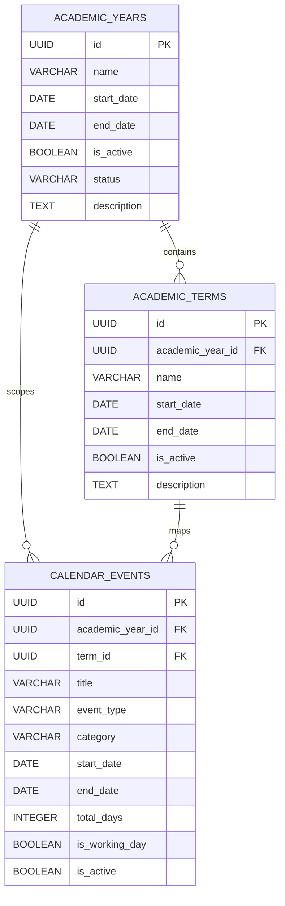

# School Academic Calendar & Holiday Management — Walkthrough

## Executive Summary
We have designed, built, integrated, and verified the **Academic Calendar & Holiday Management** module for **St. Vincent's School HRMS**.

This module acts as the authoritative institutional clock and single source of truth across the school system, governing:
1. **Academic Years / Sessions** (Multi-year tracking with strict single-active session rule)
2. **School Terms** (Term 1 Monsoon, Term 2 Winter, Term 3 Spring, etc.)
3. **Holidays & Closures** (Public holidays, festival holidays, school closures, weather emergencies, non-instructional staff training days, and working day overrides)
4. **Interactive School Calendar** (Monthly grid matrix, day inspector, and upcoming event countdowns)
5. **Universal Integration Layer** (Cross-system Day Status lookup API for Attendance, Leave Quota calculations, and Payroll)

---

## 1. Database Schema & Architecture

Three dedicated PostgreSQL tables were created and indexed:

---

## 2. API Endpoints Built

All 21 REST API endpoints mounted under `/api/academic-calendar`:

| Method | Endpoint | Description | Access Role |
|---|---|---|---|
| `GET` | `/api/academic-calendar/overview` | Dashboard stats, active year, active term, working days, today's status | All Staff |
| `GET` | `/api/academic-calendar/month` | Monthly calendar matrix with daily event chips & working indicators | All Staff |
| `GET` | `/api/academic-calendar/day-status` | Date status inspector (`is_working_day`, `day_type`, `term`, `events`) | All Staff |
| `GET` | `/api/academic-calendar/years` | List all academic sessions with terms & events count | All Staff |
| `POST` | `/api/academic-calendar/years` | Create academic year session | Super Admin, Admin |
| `PUT` | `/api/academic-calendar/years/:id` | Update academic year session boundaries | Super Admin, Admin |
| `PATCH`| `/api/academic-calendar/years/:id/activate` | Atomically set active session & complete previous session | Super Admin, Admin |
| `DELETE`| `/api/academic-calendar/years/:id` | Soft delete / archive session | Super Admin, Admin |
| `GET` | `/api/academic-calendar/terms` | List school terms (filterable by year) | All Staff |
| `POST` | `/api/academic-calendar/terms` | Create term with date validation | Super Admin, Admin, HR |
| `PUT` | `/api/academic-calendar/terms/:id` | Update school term | Super Admin, Admin, HR |
| `PATCH`| `/api/academic-calendar/terms/:id/status` | Activate / Deactivate term | Super Admin, Admin, HR |
| `GET` | `/api/academic-calendar/events` | List events with multi-criteria search & filters | All Staff |
| `POST` | `/api/academic-calendar/events` | Create single or multi-day holiday / closure / override | Super Admin, Admin, HR |
| `PUT` | `/api/academic-calendar/events/:id` | Update calendar event | Super Admin, Admin, HR |
| `PATCH`| `/api/academic-calendar/events/:id/status` | Toggle event active status | Super Admin, Admin, HR |
| `DELETE`| `/api/academic-calendar/events/:id` | Delete calendar event | Super Admin, Admin, HR |
| `GET` | `/api/academic-calendar/upcoming` | Upcoming holidays & events with days-remaining countdown | All Staff |

---

## 3. Frontend UI Components Built

All components built in `frontend/src/components/calendar/`:
- **`AcademicCalendarModule.jsx`**: Master container managing tabs (`overview`, `holidays`, `terms`, `years`).
- **`CalendarOverviewView.jsx`**:
  - 4 KPI Stat Cards (`Academic Session`, `Current School Term`, `Upcoming Holiday`, `Working Days This Month`).
  - **Today Status Banner** with real-time institutional classification.
  - **Interactive Month Calendar Grid** with color-coded chips for Holidays, Non-instructional days, and School closures.
  - **Upcoming Events Sidebar** with countdown badges (`Today`, `Tomorrow`, `X days away`).
- **`DayDetailModal.jsx`**: Date inspector showing working status, curricular term, and all scheduled events on that day.
- **`AcademicYearsView.jsx`**: Session management table with single-click `Set Active` transaction.
- **`TermsView.jsx`**: School terms registry with date range validation.
- **`HolidaysView.jsx`**: Full searchable registry of holidays, breaks, and closures with multi-attribute filtering (Year, Type, Status).
- **`AddEditEventModal.jsx`**: Compact modal with dynamic categories, multi-day auto duration calculation, and staff working day toggles.
- **`AddEditYearModal.jsx` & `AddEditTermModal.jsx`**: Boundary validation dialogs.

---

## 4. Verification Results

1. **Automated Calendar API Test Suite**: **11 / 11 tests passed (100%)**.
2. **End-to-End System Test Suite**: **7 / 7 tests passed (100%)** covering Auth, HR data, Attendance, Leave, and Academic Calendar across all 5 user roles.
3. **Frontend Production Build**: Vite compiled **1,877 modules in 1.15s** with **0 errors**.
